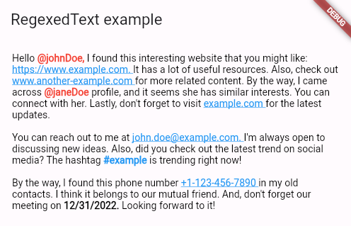

### RegexedText

This package extends the Text widget to provide additional functionality for highlighting text that matches a given list of RegExp patterns.

##### Key Features

- Highlight parts of the text that match certain patterns. Each pattern can have its own unique style.
- Handle taps on a part of the text that matches a pattern.
- Extend the functionality of the Flutter `Text` widget.

##### Example

```dart
import 'package:flutter/material.dart';
import 'package:regexed_text/regexed_text.dart';

const longTextExample = """
Hello @johnDoe, I found this interesting website that you might like: https://www.example.com. It has a lot of useful resources. Also, check out www.another-example.com for more related content. By the way, I came across @janeDoe profile, and it seems she has similar interests. You can connect with her. Lastly, don't forget to visit example.com for the latest updates.

You can reach out to me at john.doe@example.com. I'm always open to discussing new ideas. Also, did you check out the latest trend on social media? The hashtag #example is trending right now!

By the way, I found this phone number +1-123-456-7890 in my old contacts. I think it belongs to our mutual friend. And, don't forget our meeting on 12/31/2022. Looking forward to it!
""";

void main() {
  runApp(const MainApp());
}

class MainApp extends StatelessWidget {
  const MainApp({super.key});

  @override
  Widget build(BuildContext context) {
    return MaterialApp(
      home: Scaffold(
        appBar: AppBar(
          title: const Text('RegexedText example'),
        ),
        body: Padding(
          padding: const EdgeInsets.all(18),
          child: RegexedText(
            longTextExample,
            patterns: [usernamePattern, urlPattern, emailPattern, hashtagPattern, phoneNumberPattern, datePattern],
            normalStyle: const TextStyle(color: Colors.black),
            regexedStyle: (pattern) {
              if (pattern == usernamePattern) {
                return const TextStyle(color: Colors.red, fontWeight: FontWeight.w600);
              }

              if (pattern == hashtagPattern) {
                return const TextStyle(color: Colors.blue, fontWeight: FontWeight.w600);
              }

              if (pattern == datePattern) {
                return const TextStyle(color: Colors.black, fontWeight: FontWeight.w600);
              }

              return const TextStyle(color: Colors.blue, decoration: TextDecoration.underline);
            },
            onTap: (text) {
              print(text);
            },
          ),
        ),
      ),
    );
  }
}
```




License

This project is licensed under the MIT License - see the [LICENSE](https://github.com/elrizwiraswara/regexed_text?tab=MIT-1-ov-file) file for details.
